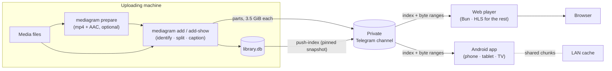

<div align="center">

# mediagram

**Your own film, series and course library, stored in a private Telegram channel and played back anywhere.**

[](crates/mediagram)
[](web)
[](android)
[](Cargo.toml)
[](Cargo.toml)

[How it works](#how-it-works) ·
[Quick start](#quick-start) ·
[Uploading a folder](#uploading-a-folder-of-films-and-shows) ·
[Commands](#commands) ·
[Web player](#the-web-player) ·
[Android](#the-android-app) ·
[Docs](#documentation)

</div>

---

A Rust CLI splits each file into raw byte-range parts (3.5 GiB by default,
under Telegram Premium's 4 GB per-message cap) and uploads every part with a
structured caption. A SQLite index (`library.db`) is the canonical record of
what the channel holds, and a snapshot of it is pinned in the channel itself.
A web player and an Android app read that index and stream the bytes straight
from Telegram, with no media server in between.

Nothing is re-encoded to store it and nothing is recommended by an algorithm.
The library is a catalogue of things you already own, and the job is finding
one and watching it.

## Highlights

**Uploader (`mediagram`)**
- Films, series, documentaries and courses, each identified once, through
  TMDB or from the folder layout.
- Whole folders at a time. Re-running a folder skips what is already
  uploaded, and an interrupted upload resumes without sending a part twice.
- `prepare` makes files browser-playable before upload (mp4 container, AAC
  audio, faststart), so the player does not convert them on every play.
- Uploads run in the background and queue behind each other; `status` shows
  progress from any terminal.
- Two machines can publish to the same channel: every publish merges the
  channel's index first.
- `verify --full` re-downloads every part and checks it against the SHA-256
  recorded at upload.

**Web player (`web/`)**
- A dark, magazine-style catalogue with TMDB backdrops and posters. Episodes
  are grouped into shows and lessons into courses.
- Profiles (including kids' profiles with age ratings), Continue watching,
  a watchlist and collections. Watch state is shared between devices through
  the channel.
- Seekable playback of any set. What a browser cannot decode (Matroska, HEVC,
  AC-3) is converted to HLS on the fly.

**Android app (`android/`)**
- Phone, tablet and Google TV (leanback) from one app, at parity with the
  web player.
- Uses the same Rust core as the uploader through UniFFI, so there is one
  Telegram byte path, not two.

**LAN cache (`mediagram_cache`)**
- A small chunk store for the home network. A chunk one device fetched from
  Telegram is not fetched again by the next.

## How it works



Every part carries a caption (`#mlib v=2` plus minified JSON) with the file's
metadata, provider ids, and the part's own offset, length and SHA-256. The
channel alone is therefore enough to rebuild the index (`mediagram rescan`).
The format is specified in [`docs/mlib-spec.md`](docs/mlib-spec.md).

## Quick start

### Requirements

| | |
|---|---|
| Rust | 1.87+ (edition 2024); `rust-toolchain.toml` pins `stable` |
| ffmpeg | `ffmpeg` and `ffprobe` on `PATH`, for inspection and remuxing |
| SQLite | a system `libsqlite3`. `rusqlite` links against it, because grammers already statically links its own copy and two bundled copies collide at link time |
| Telegram | an `api_id`/`api_hash` from <https://my.telegram.org>, and a private broadcast channel where your account is an admin. Premium is needed for the 3.5 GiB parts |
| TMDB | a free [API key](https://www.themoviedb.org/settings/api). Optional if every `add` uses `--manual` |

### Install and sign in

```sh
cargo build --release          # binary at target/release/mediagram
mediagram login                # asks for api_id, api_hash, channel, tmdb_key; then phone → code → 2FA
mediagram whoami               # proves the session works and the channel resolves
```

`login` writes `~/.config/mediagram/config.toml` (mode 600) and must be run in
a real, interactive terminal. If `whoami` cannot find the channel, it lists
every channel the account can see, which usually shows the typo.

### Upload something

```sh
mediagram add "~/Films/Arrival (2016).mkv" --tmdb 329865
mediagram add-show ~/Shows/Severance --tmdb 95396 --dry-run
mediagram add-course "~/Courses/Rust Course" --dry-run
mediagram status
```

`add` returns as soon as the set is planned (inspected, identified, split and
indexed) and leaves the bytes to a background process that outlives the
terminal; its output goes to `<data dir>/background.log`. Pass `--watch` to
stay in the foreground with a live progress line.

### Watch it

```sh
cd web && bun install
bun run login      # once: issues the player its own session, into web/.env
bun run dev        # serves the library on your network, port 8770
```

## Uploading a folder of films and shows

The everyday job: a download folder holding some films and some series, part
of which may already be in the library. In order:

**1. Merge the channel's index first.** Another machine may have uploaded
titles this one does not know about, and "already held" can only be checked
against an index that includes them:

```sh
mediagram pull-index
```

**2. Prepare the files.** Matroska files and AC-3/E-AC-3 audio are converted
by the web player on every play. `prepare --mp4` fixes that once, before
upload, by changing only the container and the audio. It also drops audio
and subtitle tracks that are not German or English (`--audio`, `--subs`).

```sh
mediagram prepare "Mad Men (2007)"                          # report only
mediagram prepare "Mad Men (2007)" --mp4 --out ~/prepared   # copies, originals kept
mediagram prepare "Mad Men (2007)" --mp4 --replace          # rewrite in place
```

HEVC video cannot be helped this way, because the picture is never
re-encoded; `prepare` says so when it applies. `add-show` runs the same
survey and asks before uploading anything it would leave converting, and
`--yes` skips that question, so pass `--yes` only once you have seen the
report.

**3. Upload what is not there yet.**

- **Series:** `add-show` skips episodes that are already complete, so it
  can be pointed at a whole show every time. Look the id up on TMDB, and
  dry-run first:

  ```sh
  mediagram add-show "Mad Men (2007)" --tmdb 1104 --dry-run
  mediagram add-show "Mad Men (2007)" --tmdb 1104 --no-push
  ```

  It refuses a folder holding two files for one episode, for example an
  `.mkv` beside its converted `mp4/` copy. Point it at one of them.
- **Films:** `add` does **not** check whether a film is already held.
  Look the title up in `mediagram status` (or search `library.db`) before
  adding it again, and pass `--tmdb` so nothing prompts:

  ```sh
  mediagram add "Anaconda (2025).mkv" --tmdb 1234731 --no-push
  ```

- Skip anything still downloading (`*.tmp`, `*.part`).

Uploads queue behind each other, so it is fine to start them one after
another; `mediagram status` shows the one on the wire and the rest waiting.

**4. Publish once at the end.** Every push re-pins the index, and Telegram
answers a burst of pins with a long `FLOOD_WAIT`. That is why step 3 passes
`--no-push`. When everything is up (or whenever the titles so far should
appear in the players), publish once:

```sh
mediagram push-index --merge
```

`--merge` pulls the channel in again first, so titles another machine
uploaded in the meantime are kept rather than dropped. Two machines may
upload at the same time, but each must upload its own folders: nothing
de-duplicates across machines until the next merge.

## Commands

| Command | What it does |
|---|---|
| `login` | Sign in with phone + code (+ 2FA password) and persist the session. **Needs a real, interactive terminal.** |
| `whoami` | Print the signed-in account and the resolved library channel. |
| `add <file>` | Split, upload, caption and index one file. Returns once the set is planned; `--watch` stays and shows the upload. `--delete-source` removes the file once every part is in the channel. Does not de-duplicate. See [`add` flags](#add-flags). |
| `add-show <dir> --tmdb <id> [--dry-run] [--yes]` | Upload every episode of a series, one set each. Season and episode come from the file name, the show from `--tmdb` (required, because release prefixes defeat the title guess). Reports what the player would convert and asks first. Re-running skips complete episodes. |
| `add-course <dir> [--dry-run]` | Upload a course: subfolders are chapters, videos are lessons, PDFs beside them are documents. Re-running skips what finished. |
| `add-docu <path> [--dry-run]` | Upload a documentary, or a folder of them as one collection. Re-running skips what finished. |
| `resume [--no-push]` | Finish every set an interrupted upload left `pending`, adopting parts already in the channel instead of sending them again. |
| `status` | What the library holds and what is going in: the set on the wire with its progress, the queue, each show against what TMDB says exists, and anything unfinished. Read-only. |
| `prepare <path> [--replace \| --out <dir>] [--mp4] [--audio a,b] [--subs a,b]` | Drop unwanted audio and subtitle tracks. `--mp4` also converts to a browser-playable mp4 (Matroska → mp4, audio → AAC, picture copied untouched). `--replace` rewrites in place, and only after the result passes every check. |
| `push-index [--merge \| --check \| --force]` | Snapshot `library.db` and pin it in the channel. Refuses a push that would drop sets the channel holds; `--merge` pulls them in first. |
| `pull-index [--dry-run]` | Merge the channel's index into this one, so titles uploaded from another machine are known here. Backs up the local index first. |
| `sync-index [--refresh-older-than <days>]` | The whole round trip: `pull-index`, `metadata`, `posters`, then a merged push. A failed artwork fetch is reported and the push goes ahead. |
| `metadata` | Record what TMDB says about each film and series (synopsis, genres, rating, network, status, season and episode counts). Reads the payloads `add` cached, so it usually needs no key and no network. |
| `posters` | Fetch cover art into `<data dir>/posters/` for a player reading this machine's index. Re-running skips what is held. |
| `artwork` / `edit` | Override a title's poster or backdrop; correct a set's metadata and rewrite its captions. |
| `verify <set-id> \| --all [--full] [--since <unix>]` | Compare each part's message against the index; `--full` re-downloads and hashes every part, and `--since` lets an interrupted sweep resume. |
| `remove <set-id>` | Permanently delete a set: its channel messages and its index rows. |
| `rescan` | Rebuild `library.db` from channel captions. Additive only: it never demotes or deletes a set the index already has. |
| `export-package [--publish] [--dry-run]` | Build the encrypted prebuilt package a player can read from a plain URL. See [publishing a package](#publishing-a-package-for-a-player). |
| `serve` | Serve this machine's library over HTTP (Range requests over a set's parts). |

`--full` re-downloads every byte, 512 KiB per request, so a multi-terabyte
library takes hours; it prints the total and an estimate before it starts.
A failing part is recorded as `FAIL` and the sweep carries on.

<details>
<summary><b><code>add</code> flags</b></summary>

<a id="add-flags"></a>

```
mediagram add <file>
  --tmdb <id>        TMDB id (movie or show)
  --tvdb <id>        Stored verbatim; never fetched from TVDB
  --imdb <id>        With or without the `tt` prefix
  --season <n>
  --episode <n>
  --abs <n>          Absolute episode number (anime)
  --variant <label>  Distinguishes alternate cuts/qualities of the same title
  --manual           Enter metadata by hand instead of looking it up on TMDB
  --course, --cid, --chapter, --chap, --lesson   add one course lesson by hand
  --no-remux         Skip the MP4 faststart remux
  --alang a,b,c      Override detected audio languages
  --slang a,b,c      Override detected subtitle languages
  --hdr <label>      Override detected HDR format (SDR, HDR10, HLG, DV)
  --no-push          Do not push the index after this set completes
  --delete-source    Delete the file once every part is in the channel
  --watch            Stay and show the upload instead of backgrounding it
```

An explicit `--tmdb`/`--tvdb`/`--imdb` never prompts. Without one, an
ambiguous filename match prompts interactively unless `--manual` is given.

</details>

<details>
<summary><b>Adding a course</b></summary>

A course has chapters, a chapter has lessons, and each lesson is one video
file, so it becomes one ordinary set.

```sh
mediagram add-course "~/Courses/Rust Course" --dry-run
mediagram add-course "~/Courses/Rust Course"
```

Each subfolder is a chapter and each video inside it a lesson; the leading
number is the number and the rest is the title. A flat folder is one chapter.
The dry-run table shows every inferred number and title before anything
uploads, with `L` marking a lesson and `D` a document.

PDFs are uploaded as documents: a handout beside its lesson, or a workbook in
a folder with no video at all. A document is numbered inside its chapter like
a lesson, so `03 Signal.pdf` sits beside `03 Signal.mp4` in the player.
Subtitles, artwork and other files are ignored. Adding PDFs to a course that
is already uploaded moves nothing: a re-run uploads the documents and skips
every finished lesson.

Courses never touch TMDB, so no API key is needed. Identity is the collection
id plus chapter and lesson numbers, so a re-run survives renaming or moving
the folder; pass `--cid` to keep the grouping stable across a retitle.

</details>

<details>
<summary><b>An existing library, or a new machine</b></summary>

**Same machine, index intact.** The data dir (`~/.local/share/mediagram`, or
`data_dir`) already holds `library.db`, the session and the TMDB cache:

```sh
mediagram status
mediagram resume       # completes every pending set
mediagram verify --all # metadata-only check; --full re-downloads and hashes
```

**New machine, library already in the channel.** Log in, then get an index.
Copying it across keeps what the channel does not record (`verified_at`
timestamps, the TMDB cache):

```sh
# with nothing uploading on the old host; the -wal sidecar holds recent writes
scp old-host:'~/.local/share/mediagram/library.db*' ~/.local/share/mediagram/
```

Otherwise rebuild it from the channel's own captions with `mediagram rescan`,
or merge the pinned index with `mediagram pull-index`. On a machine that has
never run `add` the TMDB cache is cold, so `metadata` and `posters` need a real
`tmdb_key`; copy `tmdb-cache/` to avoid that. Do not copy `session.sqlite`
around casually: it is the account.

</details>

<details>
<summary><b>Publishing a package for a player</b></summary>

<a id="publishing-a-package-for-a-player"></a>

A player can read the pinned `library.db` from the channel, but it has to be
logged in first and it gets no artwork. The prebuilt package is one encrypted
file on a plain URL holding the index and its posters.

```sh
head -c 32 /dev/urandom | base64      # once; keep the output as package_key
mediagram export-package --dry-run    # what would be included
mediagram export-package --publish    # write, encrypt, upload via publish_cmd
```

The archive is uploaded before `latest.json`, so a player never sees a pointer
to a missing file. Give the player the `latest.json` URL and the same key.

The package holds your private channel id and every message id, and the key is
the only thing protecting it: the URL is not a secret, the key is. Format 1
does not sign the pointer, so someone controlling the host can withhold
updates but cannot pass off stale content as fresh. See
[`docs/mlib-package-v1.md`](docs/mlib-package-v1.md).

</details>

## The web player

`web/` is a Bun server that holds its own Telegram session, reads the
published index, serves any set as one seekable HTTP file assembled from its
parts, and converts on the fly what a browser will not decode. It needs
nothing from the uploader's disk, so it can run on any machine.

```sh
cd web
bun install
bun run login      # once: issues a session and writes web/.env, mode 600
bun run dev        # listens on the network, and says so
bun run start      # loopback only, for running behind a proxy
```

Its catalogue comes from the channel's pinned index or, given
`MEDIAGRAM_PACKAGE_URL` and `MEDIAGRAM_PACKAGE_KEY`, from a package published by
`export-package`.

> [!WARNING]
> The player has **no authentication of its own**. On anything but a network
> you trust, put it behind a reverse proxy that does.
> [`docs/running-the-player.md`](docs/running-the-player.md) covers it end to
> end: sessions, which titles convert and why, Caddy with TLS, stalls, and
> revoking access.

## The Android app

`android/` is a Kotlin + Jetpack Compose app for phones, tablets and Google TV.
The Telegram transport and the index come from `crates/mediagram-core`, the
same Rust code the uploader uses, called through UniFFI.

```sh
# needs ANDROID_NDK_HOME and cargo-ndk
scripts/build-android-core.sh          # cross-compile the Rust core for every ABI
cd android && ./gradlew installDebug   # set ANDROID_SERIAL when several devices are attached
```

Rebuild the core after any Rust change. A stale native library still builds,
but the app crashes at launch.

## Configuration

`mediagram login` writes `$XDG_CONFIG_HOME/mediagram/config.toml` on first run.
To write it by hand, copy [`config.example.toml`](config.example.toml) and fill
in `api_id`, `api_hash`, `channel` (a `-100…` id or the exact title) and
`tmdb_key`. Optional keys: `part_size`, `throttle_ms`, `max_attempts`,
`tmp_dir`, `data_dir`, and the package settings. Every key can be overridden
with a `MEDIAGRAM_<KEY>` environment variable, and `--config` points at a
different file.

## Under the hood

**The 3.5 GiB part rule.** Files are split into raw, contiguous byte ranges,
never re-encoded, sized to a multiple of 1 MiB: **3,758,096,384 bytes
(3.5 GiB)** by default. That stays comfortably under Telegram Premium's 4 GB
document cap however it is enforced; a live test uploading a full 3.5 GiB part
to a Premium channel saw no throttling. `part_size` can go up to
`4 GiB − 1 MiB`.

**Repository layout.**

```
crates/
├── mlib-spec/        the contract: caption, part plan, filename grammar, index schema. No IO
├── mediagram-tmdb/   TMDB client with disk cache, provider details, poster download
├── mediagram-core/   portable client: UniFFI surface for Android, catalog store, byte path
├── mediagram/        the uploader CLI: inspection, upload pipeline, index, verify, serve
└── mediagram-cache/  the LAN chunk store; shares nothing with the uploader's index
web/                  the Bun web player (server in src/, browser app in public/)
android/              the Android app: phone, tablet and TV
```

## Documentation

| Document | Covers |
|---|---|
| [`docs/mlib-spec.md`](docs/mlib-spec.md) | The storage format: captions, parts, index schema |
| [`docs/mlib-package-v1.md`](docs/mlib-package-v1.md) | The encrypted prebuilt package and its threat model |
| [`docs/system-architecture.md`](docs/system-architecture.md) | Crates, data flow, the Android byte path, the LAN cache |
| [`docs/web-player.md`](docs/web-player.md) | The web player's modules, routes and codec policy |
| [`docs/running-the-player.md`](docs/running-the-player.md) | Deploying the player safely |
| [`docs/code-standards.md`](docs/code-standards.md) | Conventions for contributors |
| [`docs/project-changelog.md`](docs/project-changelog.md) | What changed, release by release |

---

<sub>MIT licensed. This product uses the TMDB API but is not endorsed or certified by TMDB.</sub>
